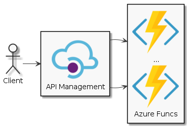

# Overview

The PlantUML offers a great way to speed-up creation of architectural diagrams. However, the default rendering might look overwhelming and noisy for non-technical people. Using familiar icons, helps them to understand the diagram without knowing the UML.

This repository demonstrates how to use plantuml with custom images, i.e. Azure icons. Unlike other solutions, here we do not use sprites, but png images.

## Getting started

Navigate to [PlantText WebSite](planttext.com) and use the following snippet:

``` bash
skinparam monochrome true
skinparam defaultTextAlignment center

!define Url https://raw.githubusercontent.com/bgener/plantuml-azure-icons/master/images
rectangle "\nAPI Management" as apim
rectangle "\n...\n\nAzure Funcs" as backend
actor Client

Client -> apim
apim -right-> backend
apim -right-> backend
```

This will render the diagram as shown:



## Advanced example

Here is a more complex example where we define re-usable components, so that we can 

``` bash
skinparam monochrome true
skinparam defaultTextAlignment center

!define Url https://raw.githubusercontent.com/bgener/plantuml-azure-icons/master/images
rectangle "\nOrchestration Layer" as orchestration
rectangle "\nMicroservice2" as service2

!definelong CreateAzureFuncs(alias, caption)
    rectangle "\n...\n\n caption" as alias
!enddefinelong

!definelong CreateAPIManagement(alias, caption)
    cloud "\n caption" as alias
!enddefinelong

!definelong CreateAzureServiceBus(alias, caption)
    node "\n caption" as alias
!enddefinelong

CreateAPIManagement(apim, APIM)
CreateAzureFuncs(funcs, Backend)
CreateAzureServiceBus(servicebus, Service Bus)
CreateAPIManagement(service1, Microservice1)
CreateAzureFuncs(backend, Microservice1)


apim -right-> funcs
apim -right-> funcs
funcs -right-> servicebus

servicebus -down-> orchestration
orchestration -> service1
orchestration -down-> service2
service1 -> backend
```


## Resources

* [PlantUML guide](http://plantuml.com/guide)
* [Azure-PlantUML with sprites](https://github.com/RicardoNiepel/Azure-PlantUML)
